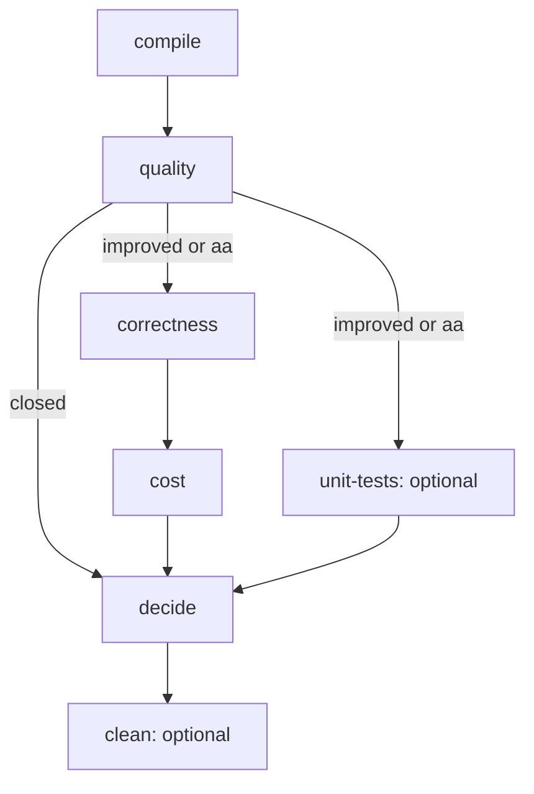

# Documentation

Start with [setup](environments.md), then follow the workflow. Each stage page owns its
command, prerequisites, work, outputs, retry behavior and next step. Choose a profile at
`compile`; later stages use the profile saved in that session.

## Workflow

Correctness and optional unit tests can run in parallel after an open gate. Cost waits for
correctness, without waiting for unit tests. If unit tests start, their result counts at
`decide`. A/A sessions open the gate as a harness check when all quality checks pass.

| Step | Guide | Purpose | Host |
| --- | --- | --- | --- |
| 1 | [compile](workflow/compile.md) | Create the session, build both revisions and round-trip the inputs | Busy |
| 2 | [quality](workflow/quality.md) | Measure `D2`/`N2`, check outputs, audit determinism and compute the gate | Busy |
| 3 | [correctness](workflow/correctness.md) | Baseline preflight, C1–C5, API contracts and C7 | Busy |
| 4 | [unit-tests](workflow/unit-tests.md) | Optional upstream Python/Rust suites; if started, they count | Busy |
| 5 | [cost](workflow/cost.md) | Fresh timing and memory panels for both arms | Quiet, exclusive |
| 6 | [decide](workflow/decide.md) | Merge committed evidence and write the verdict/report | Any |
| 7 | [clean](workflow/clean.md) | Remove one session's bulk, retain results | Any |

`decide` can run once the session exists, including while stages are unfinished and after
cleanup. Common lifecycle and exit rules are in [sessions](sessions.md).

## Shared operating guides

| Guide | Use it for |
| --- | --- |
| [Setup and environments](environments.md) | Requirements, installation, pinned dependencies and worker environment |
| [Sessions](sessions.md) | Session directories, prerequisites, locks, retries, workers and exit codes |
| [Baseline store](store.md) | Reuse across sessions, content keys, layout and manual maintenance |
| [Cluster execution](cluster.md) | Shared paths, compatible hosts, runner locks and LSF job chains |

## Profiles

| Guide | Use it for |
| --- | --- |
| [Iterations profile](iterations-profile.md) | Default inner-loop workload, IA1–IA6, weights, power and budget |
| [Confirm profile](confirm-profile.md) | Broad confirmation workload, CA1–CA6, families, coverage and limits |

Iterate on the iterations profile and confirm once before claiming a broad gain. The confirm
workload is public and has no held-back part; do not tune on it.

## Technical references

| Reference | Use it for |
| --- | --- |
| [Metrics](metrics.md) | `D2`/`N2`, paired scores/SE, weights, quality guards, cost estimators and coverage |
| [Verifier](verifier.md) | Oracle contracts, eligibility, tolerances, coverage and verification limits |
| [Output formats](output-format.md) | Session files, JSON fields, records, reports and canonical circuit files |
| [Architecture](architecture.md) | Trust boundaries, components, process model and source layout |
| [Versioning](versioning.md) | Artifact tags, frozen profiles, compatibility and migration rules |

## Maintainer evidence

- [Implementation and runner validation](validation.md): implemented features, dated evidence,
  known-outcome controls, new-runner checks and remaining validation work.
- [Historical issue resolutions](fable-issues-resolution.md): the dated review of the original
  design findings; this is a history page, not the operating guide.
- [Fixture provenance](../fixtures/PROVENANCE.md): source licenses and recorded substitutions.
- [Design plans](../design/): original reasoning and implementation plans; use the workflow
  guides above for the current commands.
