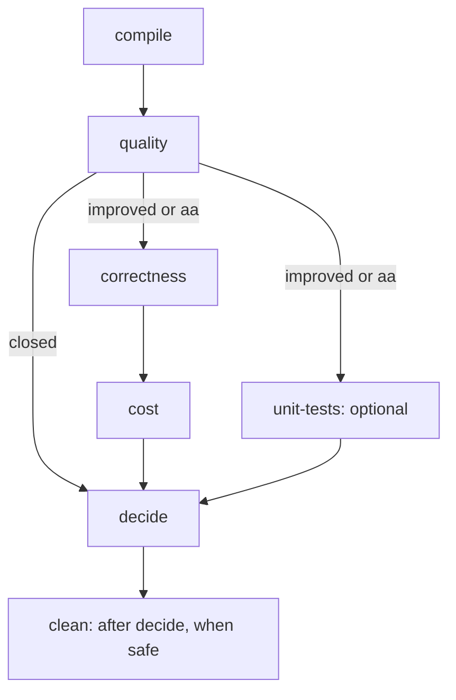

# Documentation

Start with the **[LSF session guide](cluster.md)**: running a comparison on the cluster is one
launcher command, and a manager job runs every stage. The [workflow overview](workflow/README.md)
explains the stages and how to run them directly, for local work, debugging and replay. Each
stage page owns its command, prerequisites, work, outputs, retry behavior and next step.
Choose a profile at launch (or at `compile`); later stages use the profile saved in that
session.

## Operating guides

| Guide | Use it for |
| --- | --- |
| [LSF session guide](cluster.md) | Setup, starting a session, watching jobs, reading results, DEBUG logs, stopping and recovering, troubleshooting |
| [Workflow overview](workflow/README.md) | The seven stages, their dependencies, the gate and stage exits; the manual command sequence |
| [Setup and environments](environments.md) | Requirements, installation, pinned dependencies and worker environment |
| [Sessions](sessions.md) | Session directories, prerequisites, locks, retries, noisy stages, workers and exit codes |
| [Baseline store](store.md) | Reuse across sessions, content keys, layout and manual maintenance |

## Stages

| Step | Guide | Purpose | On LSF |
| --- | --- | --- | --- |
| 1 | [compile](workflow/compile.md) | Create the session, build both revisions and round-trip the inputs | 16 slots |
| 2 | [quality](workflow/quality.md) | Measure `D2`/`N2`, check outputs, audit determinism and compute the gate | 16 slots |
| 3 | [correctness](workflow/correctness.md) | Baseline preflight, C1–C5, API contracts and C7 | 16 slots |
| 4 | [unit-tests](workflow/unit-tests.md) | Optional upstream Python/Rust suites; if started, they count | 16 slots |
| 5 | [cost](workflow/cost.md) | Fresh timing and memory panels for both arms, monitored for interference | 9 exclusive cores, quiet host |
| 6 | [decide](workflow/decide.md) | Merge committed evidence and write the verdict/report | Inside the manager |
| 7 | [clean](workflow/clean.md) | Remove one session's bulk, retain results | 16 slots, after decide |

## Profiles

| Guide | Use it for |
| --- | --- |
| [Iterations profile](iterations-profile.md) | Default inner-loop workload, IA1–IA6, weights, power and budget |
| [Confirm profile](confirm-profile.md) | Broad confirmation workload, CA1–CA6, families, coverage and limits |

Iterate on the iterations profile and confirm once before claiming a broad gain. The confirm
workload is public and has no held-back part; do not tune on it.

## Technical references

| Reference | Use it for |
| --- | --- |
| [Metrics](metrics.md) | `D2`/`N2`, paired scores/SE, weights, quality guards, cost estimators and coverage |
| [Verifier](verifier.md) | Oracle contracts, eligibility, tolerances, coverage and verification limits |
| [Output formats](output-format.md) | Session files, JSON fields, records, reports, LSF orchestration records and canonical circuit files |
| [Architecture](architecture.md) | Trust boundaries, components, process model and source layout |
| [Versioning](versioning.md) | Artifact tags, frozen profiles, the monitor contract, compatibility and migration rules |
| [`lsf/README.md`](../lsf/README.md) | The LSF modules, for developers |

## Maintainer evidence

- [Implementation and runner validation](validation.md): implemented features, dated evidence,
  known-outcome controls, new-runner checks, cluster calibration and remaining validation work.
- [Historical issue resolutions](fable-issues-resolution.md): the dated review of the original
  design findings; this is a history page, not the operating guide.
- [Fixture provenance](../fixtures/PROVENANCE.md): source licenses and recorded substitutions.
- [Design plans](../design/): original reasoning and implementation plans; use the guides
  above for the current commands.
