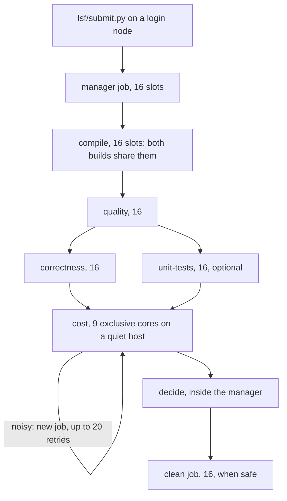

# LSF session guide

[Documentation index](README.md) · [Workflow overview](workflow/README.md) · [Session rules](sessions.md)

This is the main way to run a comparison. One launcher command validates your configuration
and submits a **manager** job; the manager runs every stage as its own LSF job, measures cost
on quiet exclusive cores, retries a cost measurement that saw interference, decides, and
cleans the session. You do not submit stages yourself.

Two words are easy to confuse. The **quiet cost job** is the `cost` stage: the only job whose
measurements need quiet cores. **Cleanup** is the `clean` stage, which runs after `decide` to
delete the session's bulk.

## At a glance



| Job | Slots | Placement | Starts after |
| --- | ---: | --- | --- |
| manager | 16 | any host; rerunnable | the launcher |
| compile | 16 | one host; the baseline and evolved builds run concurrently and share the slots | — |
| quality | 16 | one host | compile complete |
| correctness | 16 | one host | quality complete |
| unit-tests (unless `--no-unit-tests`) | 16 | one host | quality complete; runs alongside correctness |
| cost | 9 | 9 exclusive physical cores, one quiet host of the approved tier | correctness complete and unit-tests settled |
| decide | — | inside the manager | every enabled stage settled |
| clean | 16 | one host | decide wrote a current decision and the session is safe to clean |

A stage whose quality gate is closed still runs as a job with this allocation and records
`skipped` itself within seconds. Slot counts are allocations: the harness keeps its
parallelism within them.

## 1. Set up once

On a login node, in the repository checkout (on the shared filesystem):

```bash
uv sync --all-extras
```

```bash
command -v bsub bjobs bhist bkill git uv rustup cc c++
```

- LSF 10.1 or newer: the manager reads `bjobs -json`.
- `uv sync` installs the harness in `.venv/`, including the `lsf` package. Every job runs
  this environment's Python at the same absolute path, so the checkout and `.venv/` must be
  on the shared filesystem.
- Install the baseline's Rust toolchain (`rustup toolchain install <channel>`, the channel
  from the baseline's `rust-toolchain.toml`) where compute nodes can use it.
- Builds download pinned Python packages and Rust crates. When compute nodes cannot reach
  the network, warm the caches from a node that can (a first session's `compile` fills the
  store's baseline wheels), or run the first `compile` on a node with network access. See
  [setup and environments](environments.md).

## 2. Choose the inputs

- **Two Qiskit checkouts** on the shared filesystem: `--baseline` (the reference) and
  `--evolved` (your change). They are snapshotted by `compile` and never modified.
- **A profile**: `--profile iterations-profile` (the default) while iterating. Confirm once
  with `--profile confirm-profile` in a separate session, with a new `--results-root`.

## 3. Choose the shared paths

```bash
mkdir -p /shared/qtb-store /shared/qtb-sessions
```

- `--store` (or `QTB_STORE`): the baseline store; it must exist. One store serves many
  sessions ([baseline store](store.md)).
- `--results-root` (or `QTB_SESSION`): **the exact directory of this session's data**. It
  must not exist yet (`compile` creates it) and its parent must exist. Nothing is appended
  to it. Each launch starts a new session; an existing path is refused.
- The orchestration records go next to it, in `<results-root>.lsf/`: the ledger, the logs
  and the orchestration report. They stay outside the session's cleanup.

Explicit arguments win over the environment variables. See [shared paths and compatible
hosts](#shared-paths-and-compatible-hosts) for what every node must see.

## 4. Choose the site resources

| Setting | Options | Default |
| --- | --- | --- |
| Queue | `--queue` for every job; `--<job>-queue` for one | the site's default queue |
| Memory (GB) | `--<job>-mem-gb` | compile 64, quality 32, correctness 32, unit-tests 32, cost 16, clean 4, manager 4 |
| Run limit | `--<job>-wall`, `[hours:]minutes` | compile 6:00, quality 12:00, correctness 12:00, unit-tests 10:00, cost 8:00, clean 1:00, manager 168:00 |
| Cost hardware tier | `--cost-model` and/or `--cost-ncpus` (at least one) | none: you must choose |
| Cost load limit at dispatch | `--cost-max-r1m` | 10 |

`<job>` is `compile`, `quality`, `correctness`, `unit-tests`, `cost`, `clean` or `manager`.
Memory requests are in GB, as `rusage[mem=]` is on sites with `LSF_UNIT_FOR_LIMITS=GB`. The
defaults are starting points: check them against your queues' limits. The manager's run
limit must exceed every stage's.

**Fixed, not options:** 16 slots for every job except cost, 9 exclusive physical cores for
cost, both monitoring checks, and at most 20 cost noise retries (21 cost jobs).

**The quiet cost job** is submitted as:

```text
-n 9 -R "select[r1m < 10 && ncpus == 56] span[hosts=1]
         affinity[core(1,exclusive=(core,alljobs))] rusage[mem=16]"
```

The affinity request is per slot, so nine slots reserve nine physical cores with their SMT
siblings. Whole-host exclusivity (`bsub -x`) is not used. Pin the hardware tier with a
verified CPU-model selector (`--cost-model`) when your site has one; a core count alone
(`--cost-ncpus`) does not guarantee identical hardware. `r1m < 10` and `ncpus == 56` are
IOCR's starting values, not universal thresholds. A low load at dispatch improves placement
but does not guarantee quiet cores later; the cost job's own monitor checks that.

## 5. Start the session

```bash
uv run python lsf/submit.py \
  --store /shared/qtb-store \
  --results-root /shared/qtb-sessions/idea1 \
  --baseline /shared/qiskit-baseline \
  --evolved /shared/qiskit-evolved \
  --profile iterations-profile \
  --queue normal \
  --cost-ncpus 56 \
  --cost-max-r1m 10
```

Without the optional upstream tests, add `--no-unit-tests`. For detailed logs, add
`--log-level DEBUG` (or set `LSF_LOG_LEVEL=DEBUG`). `uv run python lsf/submit.py --help`
lists every option with its default.

The launcher checks the paths, the profile, the tier and every resource value, and that the
LSF commands exist, before it submits anything. It prints:

```text
Submitted manager job 812345 (LSF accepted it; the benchmark has not run yet).
  session:      /shared/qtb-sessions/idea1
  run:          20260926T101500-3fa9c1
  logs:         /shared/qtb-sessions/idea1.lsf/logs/20260926T101500-3fa9c1
  manager log:  /shared/qtb-sessions/idea1.lsf/logs/20260926T101500-3fa9c1/manager-1.log (a requeued manager: manager-2.log)
  ledger:       /shared/qtb-sessions/idea1.lsf/ledger.json
  report:       /shared/qtb-sessions/idea1.lsf/report.md
  watch:        bjobs -a -J 'qtb-20260926T101500-3fa9c1-*'
  stop:         python -m lsf.control stop --results-root /shared/qtb-sessions/idea1
```

Record the job ID and the paths. Exit status: 0 accepted, 41 a precondition is not met (an
existing session, a missing path or command), 40 LSF did not accept the manager, 64 usage.

## 6. Watch it

```bash
bjobs -a -J 'qtb-20260926T101500-3fa9c1-*'
```

```bash
uv run python -m lsf.control status --results-root /shared/qtb-sessions/idea1
```

```bash
tail -f /shared/qtb-sessions/idea1.lsf/logs/20260926T101500-3fa9c1/manager-1.log
```

- `PEND` is normal: the manager waits and never submits a duplicate. `bjobs -l <id>` shows
  the pending reason, which the manager also logs. Pending time counts toward the manager's
  deadline.
- Every job is named `qtb-<run>-<stage>[-a<attempt>]-<nonce>`. A cost job's name carries its
  attempt number.
- A job is finished when LSF reports it terminal **and** its committed stage state matches
  the job. A job that has left `bjobs` is looked up in `bhist` and in its outcome record; it
  is not assumed to have succeeded.
  An outcome file alone does not prove termination. If history cannot confirm it, the
  ledger keeps the job unresolved and the manager stops before deciding or cleaning;
  use `lsf.control reap` after scheduler visibility is restored.
- A cost job that ends `noisy` (exit 42) saw interference: it is a retry, not a failed
  candidate.

Where things are, under `<results-root>.lsf/logs/<run>/`:

| File | Content |
| --- | --- |
| `launcher.log`, `launcher.events.jsonl` | The effective configuration and the manager's submission |
| `manager-<n>.log`, `manager-<n>.events.jsonl` | Every decision of the manager's `n`-th invocation |
| `manager.<jobid>.out` | The manager job's stdout and stderr |
| `jobs/job-<key>.log`, `jobs/job-<key>.events.jsonl` | One stage job: allocation, harness output, monitoring |
| `jobs/<key>.<jobid>.out` | That job's stdout and stderr |
| `diagnostics/` | Large scheduler responses |

## 7. What happens inside

- **compile** builds the baseline (or reuses it from the store) and the evolved revision
  concurrently in one job; both builds' compilers share the 16 slots, and a finished build
  is kept if the other fails. Only when both builds and the input round-trip succeed is
  quality submitted.
- **correctness** and **unit-tests** run in parallel after quality. Cost waits for both to
  settle.
- **cost** runs on 9 exclusive cores. Before measuring, its monitor checks the allocation
  (one host, nine slots, the exclusive-core request, the approved tier), reads the CPU
  topology, pins itself to the first core and the serial cost worker to the second, and
  probes the worker core while nothing runs. During measurement it checks, in bounded
  windows of every worker process: **A**, foreign CPU time on the worker core (all SMT
  siblings) and **B**, involuntary preemption of the worker. The first failing window aborts
  the measurement; the job exits 42 and the stage is `noisy`. Details: [cost](workflow/cost.md#measurement-modes).
- **Retries.** After a `noisy` cost job the manager submits a new cost job, which is placed
  afresh. Complete, clean regime bundles from earlier attempts are reused; the interrupted
  regime is measured again from scratch. The ledger counts attempts: one initial job and at
  most 20 retries. A killed, failed or refused cost job is not retried: only positive
  contamination evidence is. A submission LSF never answered blocks further attempts while
  the manager looks for it by name; one never found within an hour counts as a lost attempt,
  is still cancelled by `reap` if it appears, and allows no retry.
- **Exhaustion.** After 21 cost jobs the manager stops, records exhaustion in the ledger and
  decides. Missing cost evidence blocks `PASS`; the verdict is normally `INCONCLUSIVE`. A
  stage failure or an independently proven violation still takes precedence.
- **decide** runs inside the manager. **Cleanup** follows as its own 16-slot job whatever the
  verdict, unless a stage is unfinished (`running`, `noisy`, or required and not started);
  the reason is logged. The verdict's exit code is kept; a cleanup problem is reported
  separately.

## 8. Read the results

1. `<results-root>/report.md`: the verdict, stage table, notes and constraints needing
   attention.
2. `<results-root>/decision.json`: the same for scripts.
3. `<results-root>.lsf/report.md`: every job with its host, exit code and output file, every
   cost attempt with its outcome and monitoring evidence, the retry budget used and remaining,
   why the pipeline stopped, and the cleanup outcome.

| Verdict | Exit | Meaning |
| --- | ---: | --- |
| `PASS` | 0 | Quality improved and every required constraint passed, cost included |
| `NO_IMPROVEMENT` | 10 | No gain beyond seed noise |
| `CONSTRAINT_VIOLATION` | 20 | A candidate check or a cost guard failed. A cost failure here was measured on clean cores |
| `INCONCLUSIVE` | 30 | Something required is missing or unresolved. "Cost: no clean measurement" means every attempt saw interference: that is not an observed regression |
| `ERROR` | 40 | A harness, build or worker failure |

The manager job's own exit status is the verdict's. Cleanup may be skipped by its safety
checks, for example after retry exhaustion (cost is `noisy`); the session then keeps its
bulk and its `report.md` says which stage is unfinished.

## 9. Stop, cancel and recover

```bash
uv run python -m lsf.control stop --results-root /shared/qtb-sessions/idea1
```

`stop` cancels the manager (after checking the job's name and owner); the manager then
cancels every job it owns, confirms they ended, and exits. If the manager was killed in a
way it could not handle (SIGKILL, a lost host), cancel what it left:

```bash
uv run python -m lsf.control reap --results-root /shared/qtb-sessions/idea1
```

`reap` refuses while a manager holds the session's lock. It cancels only jobs whose ID, name
and owner match the ledger, then settles them. Run it again if it reports unconfirmed jobs.

The manager is submitted rerunnable: if its host fails, LSF requeues it, and the new
invocation (`manager-2.log`) reconciles the ledger first: it adopts jobs that are still
running, settles those that ended and keeps the attempt count. There is no launcher resume
option. To measure again, launch a new session with a new `--results-root`; the store makes
it pay only for the evolved half. To run or replay single stages by hand, see [running the
stages directly](workflow/README.md).

## 10. Detailed logs

`--log-level DEBUG` (or `LSF_LOG_LEVEL=DEBUG`) reaches the launcher, the manager and every
job. At `INFO` the logs record decisions: the effective configuration, each submission with
its exact shell-quoted command, state transitions with pending reasons, periodic waiting
summaries, stage outcomes, retry decisions and the budget, cancellations and cleanup. `DEBUG`
adds every unchanged poll, every scheduler command and response, and each monitoring
window's raw counters. Monitoring details are written after each worker is reaped, never
inside a measured interval.

Every JSONL event has `ts` (UTC), `level`, `component`, `event`, and the correlation fields
`run_id`, `session`, `stage`, `attempt`, `job_key`, `job_id`, `nonce` (on submissions),
`host` and `pid`. Credential-looking fields are redacted.

```bash
grep -h '"event": "stage.outcome"' /shared/qtb-sessions/idea1.lsf/logs/*/manager-*.events.jsonl
```

## Troubleshooting

| Symptom | Where to look | Next action |
| --- | --- | --- |
| A job pends for hours | `bjobs -l <id>`; `poll.waiting` events | Relax `--cost-max-r1m` or the tier, or use another queue. Pending time counts toward the deadline |
| Cost exits 41: "Monitored cost cannot run in this allocation" | the cost job's log, `job.finished` | The site ignored the affinity request, the mask covers only part of an SMT core, or the host is not the approved tier. Check the queue enables affinity and the tier selector |
| "the evidence extension ... is unavailable" in `report.md` | the session's `run.json:cost_evidence` | Decide with the harness that created the session (its wheel is in `harness-wheel/`) |
| Cost attempts keep ending `noisy` | the orchestration report's cost table; `contamination*.json` under `<results-root>/cost/monitor/<job key>/` | Check which check failed and the foreign fraction. Busy tiers need calibration of thresholds and windows; narrow the tier or the load limit |
| "Retry budget exhausted" | `ledger.json` → `cost.exhausted` | The verdict is `INCONCLUSIVE`, not a regression. Launch a new session later or on a quieter tier |
| compile fails | `jobs/job-compile-*.log`; `builds/evolved-build/build.log` or the store's `build.log` | Fix the toolchain or dependency cache; launch a new session |
| A stage exits 41 "cannot run the ... build" | the job log | The node differs in OS, architecture or Python, or the interpreter path is not shared |
| Shared path missing on a node | the job's `.out` file | Mount the store, sessions, checkout and uv Python at identical paths |
| `poll.query_failed` warnings | the manager log | Transient scheduler problems; the manager keeps waiting and never assumes a job is gone |
| `cancel.unconfirmed` or leftover jobs | the manager log; `lsf.control status` | Run `lsf.control reap` |

## Shared paths and compatible hosts

Each stage can run on a different host. Then:

- **Shared filesystem, same path.** The session directory, the store, the repository
  checkout with its `.venv/`, and the Qiskit checkouts must be on a shared filesystem mounted
  at the same path on every node. Virtual environments and job files hold absolute paths,
  and `run.json:store` is absolute.
- **The Python interpreter.** Build environments link to the Python that ran `compile`,
  usually a `uv` Python under `~/.local/share/uv/python`. That directory must be shared, or
  exist at the same path on every node, including the node that first built a baseline into
  the store.
- **Host check.** Before running, each stage after `compile` checks that the OS, CPU
  architecture and Python version match each build's identity, and that the build's
  interpreter exists and runs. Otherwise it exits 41.
- **Workers.** A stage job uses the slots LSF granted (translated by `lsf/context.py`); a
  direct run uses one less than the CPU count, at most 12. The number is recorded in the
  stage's `state.json`. Quality compiles still run at most nine batches at once, and cost is
  serial.
- **Machine identity.** Each stage records its own host in `state.json`. `run.json:machine`
  is the `compile` host, for information only. The baseline quality key uses the `quality`
  host's CPU, and cost bundles record the `cost` host and its monitoring evidence.
- **The harness is pinned.** Changing the harness, including the monitor, its evidence
  validator or the allocation adapter under `lsf/`, makes later stages of a running session
  refuse to start (exit 41). Changing queues, memory or run limits does not.

## Still to calibrate on your cluster

The monitoring thresholds and window length are frozen with contract `qtb-lsf-monitor/1`
(foreign CPU below 5 % of physical-core time, at most 4 involuntary switches per second,
2-second windows); they are IOCR's starting values. Before relying on cost verdicts, run
quiet A/A sessions and controlled contention on the chosen tier to establish the false
rejection rate and the monitoring overhead ([validation](validation.md#monitored-cost-on-lsf)).
Changing a threshold is a new contract version.
