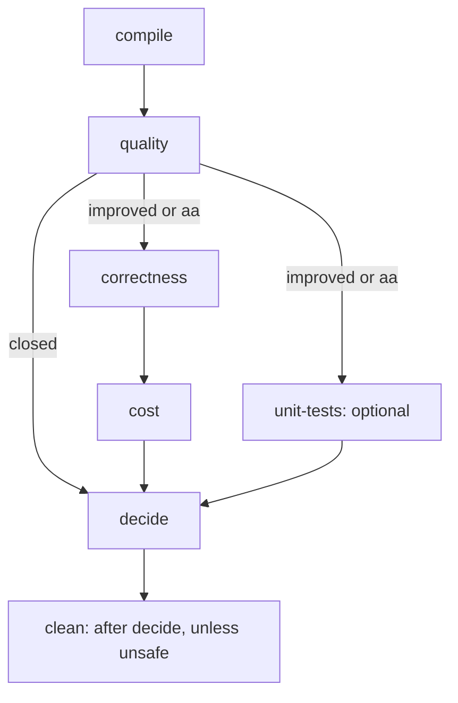

# Running the stages directly

[Documentation index](../README.md) · [LSF session guide](../cluster.md)

The primary way to run a comparison is an LSF session: one launcher command, and a manager
job runs every stage below on suitable hosts ([LSF session guide](../cluster.md)). This page
is the secondary workflow: running each stage yourself, for local work, debugging and
replaying a decision. The stages, their files and their rules are the same either way.

## The manual sequence

```bash
uv sync --all-extras
mkdir -p "$HOME/qtb-store"             # the baseline store; it must exist before compile
export QTB_STORE="$HOME/qtb-store"      # or pass --store DIR to compile
S="$HOME/qtb-sessions/idea1"            # choose a session path that does not exist yet

uv run qiskit-transpile-bench compile \
  --baseline /path/to/baseline --evolved /path/to/evolved --results-root "$S"
uv run qiskit-transpile-bench quality     --results-root "$S"
uv run qiskit-transpile-bench correctness --results-root "$S"      # skipped unless the quality gate is open
uv run qiskit-transpile-bench unit-tests  --results-root "$S"      # optional; skipped unless the gate is open
uv run qiskit-transpile-bench cost        --results-root "$S"      # skipped if correctness found a failure
uv run qiskit-transpile-bench decide      --results-root "$S"      # writes the verdict, then cleans the session
```

Add `--profile confirm-profile` to `compile` for the confirm profile. The later stages read
the profile and the store from the session. Your source folders are never modified. `uv
run` runs the CLI in this project's uv environment.

Each stage exits 0 when it completed or was skipped, so the stages up to `decide` can be
joined with `&&`. `correctness` and `unit-tests` can run at the same time, in two shells or
on two hosts. `decide` exits with the verdict's code, then cleans the session's bulk unless
a safety check refuses ([clean](clean.md)); a cleanup problem is reported separately and
never changes that code.

A direct `cost` measures in **machine mode**: it holds the per-user machine lock and waits
for the host's load to fall, so run it on an otherwise idle machine. A session launched on
LSF requires monitored cost evidence, and its `cost` stage runs only through the LSF job
entry point ([cost](cost.md#measurement-modes)).

## The seven stages

| Step | Command guide | Purpose |
| --- | --- | --- |
| 1 | [compile](compile.md) | Snapshot sources, reuse/build the baseline, build the evolved revision and verifier, round-trip the inputs |
| 2 | [quality](quality.md) | Measure circuit depth/count, check outputs, audit determinism and compute the gate |
| 3 | [correctness](correctness.md) | C1–C5, API contracts and C7; baseline preflight first |
| 4 | [unit-tests](unit-tests.md) | Optional upstream Python/Rust suites; once started they bind the verdict |
| 5 | [cost](cost.md) | Fresh timing and memory panels on quiet cores |
| 6 | [decide](decide.md) | Merge committed evidence into `decision.json` and `report.md` |
| 7 | [clean](clean.md) | Remove this session's bulk while keeping results; runs after `decide` by default |

Each command runs one step against one session directory. The baseline store is shared
across sessions; the evolved build and measurements belong to one session. A finished stage
never runs again; an interrupted, failed or noisy one resumes when called again
([session rules](../sessions.md)).

## Dependencies and the gate



The flow is `compile → quality → gate`. An improvement with every quality check passing
opens the gate; identical builds also proceed as an A/A harness check. Otherwise the later
measurement stages record `skipped`. **A closed-gate `NO_IMPROVEMENT` does not establish
semantic correctness or cost safety.** See [the gate](quality.md#the-quality-gate).

`correctness` and optional `unit-tests` can run in parallel. `cost` waits for correctness to
finish without a failed record. `decide` can run any time after the session exists;
unfinished required stages keep the verdict `INCONCLUSIVE`, and a stage crash gives `ERROR`.

## Stage exits

| Exit | Meaning |
| ---: | --- |
| 0 | Complete or skipped (also when it already was) |
| 40 | The stage failed; `decide` gives `ERROR` |
| 41 | A precondition is not met; nothing was changed |
| 42 | `cost` detected interference on its measurement core and ended `noisy`; run it again |
| 64 | Usage error |

`decide` exits with the verdict: 0 `PASS`, 10 `NO_IMPROVEMENT`, 20 `CONSTRAINT_VIOLATION`,
30 `INCONCLUSIVE`, 40 `ERROR` ([decide](decide.md#reading-the-verdict)). The full rules are
in [session rules](../sessions.md#exit-codes-of-the-stages).
